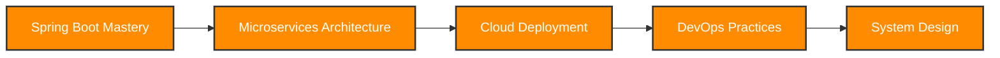

<div align="center" style="border: 6px solid #00d4ff; border-radius: 15px; padding: 20px; margin: 10px;">

# <span style="background: linear-gradient(45deg, #1e3c72, #2a5298, #00d4ff, #4facfe, #667eea); -webkit-background-clip: text; -webkit-text-fill-color: transparent; background-clip: text; font-weight: bold; font-size: 48px;">👨‍💻 RATAN SINGH</span>


[](https://github.com/Ratan1510)

---

## <span style="color: #FF8C00;">🚀 About Me</span>

```javascript
const ratan = {
    name: "Ratan Singh",
    role: "Java Full-Stack Developer",
    education: {
        degree: "B.Tech in Computer Science Engineering",
        university: "Uttaranchal University",
        year: "2022-2026"
    },
    location: "India 🇮🇳",
    languages: ["Java", "JavaScript", "TypeScript", "SQL"],
    specialties: ["Backend Development", "REST APIs", "Database Design"],
    currentFocus: "Building scalable web applications with Spring Boot",
    funFact: "I debug with coffee ☕ and solve problems with passion 🔥"
};
```

## <span style="color: #00d4ff;">💻 Tech Arsenal</span>

### 🎯 Core Technologies


### 🗄️ Databases & Tools


### 🎨 Frontend Technologies


## <span style="color: #00d4ff;">🏆 Featured Projects</span>

### 💬 [Real-Time Chat Application](https://chatapplication-ekwp.onrender.com)
*Multi-user chat platform with real-time messaging*

[](https://chatapplication-ekwp.onrender.com)
[](https://github.com/Ratan1510)

**🛠️ Built with:** Spring Boot • MongoDB • WebSockets • Thymeleaf • Lombok

**✨ Features:**
- 🔐 Multi-user authentication system
- ⚡ Real-time messaging with WebSockets
- 📱 Responsive design for all devices
- 🎨 Clean and intuitive user interface

---

### 📝 Journal Application
*Personal journaling platform with full CRUD functionality*

[](https://github.com/Ratan1510)

**🛠️ Built with:** Java • Spring Boot • MongoDB • Maven • Lombok

**✨ Features:**
- ✍️ Create, read, update, and delete journal entries
- 🔒 Secure user authentication
- 💾 Persistent data storage with MongoDB
- 🎯 Clean and minimalist design

## <span style="color: #FF8C00;">📊 GitHub Analytics</span>


## <span style="color: #FF8C00;">🎯 Current Goals & Learning</span>



- 🔭 Currently working on **advanced Spring Boot features**
- 🌱 Learning **Microservices Architecture** and **Docker**
- 👯 Looking to collaborate on **open-source Java projects**
- 💬 Ask me about **Java, Spring Boot, REST APIs, MongoDB**
- ⚡ Fun fact: **I love turning complex problems into simple solutions!**

## <span style="color: #FF8C00;">🏅 Certifications & Achievements</span>

| 🎓 Certification | 🏢 Provider | 📅 Year |
|------------------|-------------|---------|
| Java Full Stack Developer | Simplilearn | 2024 |
| Java Bootcamp | Udemy | 2024 |

## <span style="color: #FF8C00;">🌐 Let's Connect!</span>

[](https://www.linkedin.com/in/ratan-singh-37a9702b1/)
[](mailto:ratan.singh.stt@gmail.com)
[](https://github.com/Ratan1510)

---

### <span style="background: linear-gradient(45deg, #1e3c72, #2a5298, #00d4ff); -webkit-background-clip: text; -webkit-text-fill-color: transparent; background-clip: text; font-weight: bold;">💭 Developer Quote</span>

### <span style="background: linear-gradient(45deg, #1e3c72, #2a5298, #00d4ff); -webkit-background-clip: text; -webkit-text-fill-color: transparent; background-clip: text; font-weight: bold;">🎵 Music & Motivation</span>

### <span style="background: linear-gradient(45deg, #1e3c72, #2a5298, #00d4ff); -webkit-background-clip: text; -webkit-text-fill-color: transparent; background-clip: text; font-weight: bold;">🐍 Contribution Activity</span>


### <span style="background: linear-gradient(45deg, #1e3c72, #2a5298, #00d4ff); -webkit-background-clip: text; -webkit-text-fill-color: transparent; background-clip: text; font-weight: bold;">🚀 Thanks for visiting! Let's build something amazing together!</span>

**✨ Open to opportunities • Passionate about learning • Ready to contribute ✨**


</div>
